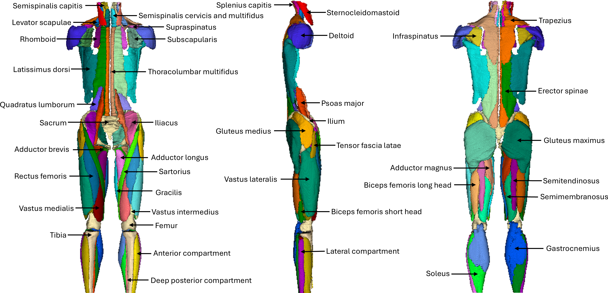

# MuscleMap: An Open-Source, Community-Supported Consortium for Whole-Body Quantitative MRI of Muscle

<p align="center">
   
</p>

## MuscleMap Toolbox
A free and open-source software toolbox for whole-body muscle segmentation and analysis.

### Dependencies

* Python 3.9.23

### Installation
We provide a step-by-step installation and usage tutorial video [here](https://www.youtube.com/watch?v=utlUVdvy6WI).

1. Install python:
   * We recommend installing [Miniconda](https://docs.anaconda.com/miniconda) or [Anaconda](https://docs.anaconda.com/anaconda).

2. Create python environment:
    ~~~
    conda create --name MuscleMap python=3.9.23
    ~~~

3. Activate python environment:
    ~~~
    conda activate MuscleMap
    ~~~

4. Download MuscleMap repository:
    1. Using the git command line tool:
        ~~~
        git clone https://github.com/MuscleMap/MuscleMap
        ~~~
    
    2. From your browser:
    
        1. Open https://github.com/MuscleMap/MuscleMap in your browser

        2. Click the green **<> Code ▼** button

        3. Click **Download Zip**

        4. Unzip the MuscleMap repository

5. Navigate to MuscleMap repository:

   ~~~
   cd ./MuscleMap
   ~~~

6. Install python packages:
    
   ~~~
   pip install -e .
   ~~~

7.  Install PyTorch with the correct CUDA Version for GPU support.
  
    The MuscleMap Toolbox works with both CPU and GPU, but performs best with a GPU-enabled PyTorch installation. If you want to use the MuscleMap Toolbox with CPU only, skip Step 7.

    The default installation of the MuscleMap dependencies (from Step 6) uses a CPU-only build of PyTorch. **To use a GPU**, you must manually install a GPU-enabled build of PyTorch. Proceed with Step 7.1 or Step 7.2 below, depending on your hardware:
    - NVIDIA GPU with a compatible **CUDA** runtime, or  
    - AMD GPU with ROCm support (Note: ROCm is supported on Linux only and requires a ROCm-compatible AMD GPU).
     
    * Step 7.1. — Check your system CUDA version (terminal)

       Open a terminal and run one of the following commands:

        For an **NVIDIA GPU** with **CUDA** runtime:
        ```
        nvidia-smi
        ```

       For an **AMD GPU** with **ROCm support**:
       ```
        rocm-smi
        ```
    
        You then need to install the corresponding GPU-compatible version of [PyTorch v2.4.0](https://pytorch.org/get-started/previous-versions/). We recommend installing the PyTorch wheel with pip.  

    * Step 7.2.  — Open a Python console and run:

        ```python
        import torch
        print("Is CUDA available?:", torch.cuda.is_available())
        ```
    If PyTorch indicates that CUDA is ** available**, then the system is functioning correctly. If PyTorch indicates that it is not available, verify whether your system has a compatible driver installed (repeat Step 2). Note: This availability check is used by PyTorch for both CUDA and ROCm backends.

8. To use mm_register_to_template, you will need [Spinal Cord Toolbox](https://spinalcordtoolbox.com/) installed. We have only tested mm_register_to_template using Spinal Cord Toolbox [Version 6.5](https://github.com/spinalcordtoolbox/spinalcordtoolbox/releases/tag/6.5).

### Usage

1. Activate python environment:
    ~~~
    conda activate MuscleMap
    ~~~

2. To run mm_segment:

    ~~~
    mm_segment -i image.nii.gz
    ~~~

    * mm_segment uses our contrast agnostic whole-body segmentation model by default with currently 89 muscles and bones.
       <details>
          <summary>Click to see the current segmentations with labels.</summary>
      
          ```
            Left Levator Scapulae 1101
            Right Levator Scapulae 1102
            Left Semispinalis Cervicis And Multifidus 1111
            Right Semispinalis Cervicis And Multifidus 1112
            Left Semispinalis Capitis 1121
            Right Semispinalis Capitis 1122
            Left Splenius Capitis 1131
            Right Splenius Capitis 1132
            Left Sternocleidomastoid 1141
            Right Sternocleidomastoid 1142
            Left Longus Colli 1151
            Right Longus Colli 1152
            Left Trapezius 1161
            Right Trapezius 1162
            Left Supraspinatus 2101
            Right Supraspinatus 2102
            Left Subscapularis 2111
            Right Subscapularis 2112
            Left Infraspinatus 2121
            Right Infraspinatus 2122
            Left Deltoid 2141
            Right Deltoid 2142
            Left Rhomboid 4101
            Right Rhomboid 4102
            Left Thoracolumbar Multifidus 5101
            Right Thoracolumbar Multifidus 5102
            Left Erector Spinae 5111
            Right Erector Spinae 5112
            Left Psoas Major 5121
            Right Psoas Major 5122
            Left Quadratus Lumborum 5131
            Right Quadratus Lumborum 5132
            Left Lattisimus Dorsi 5141
            Right Lattisimus Dorsi 5142
            Left Gluteus Minimus 6101
            Right Gluteus Minimus 6102
            Left Gluteus Medius 6111
            Right Gluteus Medius 6112
            Left Gluteus Maximus 6121
            Right Gluteus Maximus 6122
            Left Tensor Fascia Latae 6131
            Right Tensor Fascia Latae 6132
            Left Iliacus 6141
            Right Iliacus 6142
            Left Ilium 6151
            Right Ilium 6152
            Sacrum 6160
            Left Femur 6171
            Right Femur 6172
            Left Piriformis 6181
            Right Piriformis 6182
            Left Pectineus 6191
            Right Pectineus 6192
            Left Obturator Internus 6201
            Right Obturator Internus 6202
            Left Obturator Externus 6211
            Right Obturator Externus 6212
            Left Gemelli and Quadratus Femoris 6221
            Right Gemelli and Quadratus Femoris 6222
            Left Vastus Lateralis 7101
            Right Vastus Lateralis 7102
            Left Vastus Intermedius 7111
            Right Vastus Intermedius 7112
            Left Vastus Medialis 7121
            Right Vastus Medialis 7122
            Left Rectus Femoris 7131
            Right Rectus Femoris 7132
            Left Sartorius 7141
            Right Sartorius 7142
            Left Gracilis 7151
            Right Gracilis 7152
            Left Semimembranosus 7161
            Right Semimembranosus 7162
            Left Semitendinosus 7171
            Right Semitendinosus 7172
            Left Biceps Femoris Long Head 7181
            Right Biceps Femoris Long Head 7182
            Left Biceps Femoris Short Head 7191
            Right Biceps Femoris Short Head 7192
            Left Adductor Magnus 7201
            Right Adductor Magnus 7202
            Left Adductor Longus 7211
            Right Adductor Longus 7212
            Left Adductor Brevis 7221
            Right Adductor Brevis 7222
            Left Anterior Compartment 8101
            Right Anterior Compartment 8102
            Left Deep Posterior Compartment 8111
            Right Deep Posterior Compartment 8112
            Left Lateral Compartment 8121
            Right Lateral Compartment 8122
            Left Soleus 8131
            Right Soleus 8132
            Left Gastrocnemius 8141
            Right Gastrocnemius 8142
            Left Tibia 8151
            Right Tibia 8152
            Left Fibula 8161
            Right Fibula 8162
          ```
       </details>
    * The default spatial overlap during sliding window inference is 90%. If inference speed needs to be increased, the spatial overlap can be lowered. For large high-resolution or whole-body images, we recommend lowering the spatial inference to 75%:
       ~~~
       mm_segment -i image.nii.gz -s 75
       ~~~
    * Users may specify our legacy region segmentation models (version 0.0) with -r.
      * Available regions: abdomen, pelvis, thigh, and leg.
      **Note The legacy regional models are maintained for backward compatibility only. Active development and state-of-the-art MuscleMap performance are provided exclusively by the whole-body model.** 
    * mm_segment will use GPU if detected. Users can force mm_segment to use CPU with -g N.
    * Run mm_segment -h to see all available options.
    * We are continuously expanding the whole-body model. We are working on adding the arm, forearm, hand, abdomen, spine, hip rotators, pelvic floor, and foot. If you have an immediate need, please open an [issue](https://github.com/MuscleMap/MuscleMap/issues).
    
   ***We highly recommend visualizing and manually correcting the segmentations for errors. We use [ITK-SNAP](http://www.itksnap.org/pmwiki/pmwiki.php) and [Slicer](https://www.slicer.org/), which are free and open-source.***

   ***If the models do not work well on your images, please open an [issue](https://github.com/MuscleMap/MuscleMap/issues). If you share your images, we will update the MuscleMap segmentation model to improve its accuracy on your images.***

3. To run mm_extract_metrics:

    1. For T1w and T2w MRI:

        ~~~
        mm_extract_metrics -m gmm -r wholebody -i image.nii.gz -s image_dseg.nii.gz -c 3
        ~~~

    * Users may specify Gaussian mixture modeling (gmm) or kmeans clustering (kmeans) with -m.
    * Users may specify 2 or 3 components with -c.
    * For gmm, probability maps are ouput for each component and label (*_softseg.nii.gz).
    * For gmm and kmeans, binarized segmentations are ouput for each component and label (*_seg.nii.gz).

    2. For Dixon Fat-Water MRI:

        ~~~
        mm_extract_metrics -m dixon -r wholebody -f image_fat.nii.gz -w image_water.nii.gz -s image_dseg.nii.gz
        ~~~

   3. For Dixon Fat Fraction MRI or CT:

        ~~~
        mm_extract_metrics -m average -r wholebody -i image.nii.gz -s image_dseg.nii.gz
        ~~~
     
4. To run mm_segment and mm_extract_metrics via a graphical user interface (GUI):

     ~~~
     mm_gui
     ~~~
    
    * To automatically run mm_segment followed by mm_extract metrics use the chaining options in the GUI.

5. To run mm_register_to_template:

    ~~~
    mm_register_to_template -i image.nii.gz -s image_dseg.nii.gz -r abdomen
    ~~~
    
    #### Regions
    * Abdomen
        * Left and right multifidus, erector spinae, psoas major, and quadratus lumborum
    
    *Regions in development: neck, shoulder, arm, forearm, thorax, pelvis, thigh, leg, and foot*

## Data Curation
We strongly recommend following the [Brain Imaging Data Structure (BIDS)](https://bids.neuroimaging.io/) specification for organizing your dataset. 

### Convert DICOM to BIDS

1. Convert images from [DICOM](https://www.dicomstandard.org/) format to [NIfTI](https://nifti.nimh.nih.gov/) format.
    * We recommend using [dcm2niix](https://github.com/rordenlab/dcm2niix) and working with compressed [NIfTI](https://nifti.nimh.nih.gov/) files (nii.gz).
    * Keep the [json](https://en.wikipedia.org/wiki/JSON) sidecar file, which contains imaging parameters.

2. Rename the [NIfTI](https://nifti.nimh.nih.gov/) and [json](https://en.wikipedia.org/wiki/JSON) files and organize your dataset to follow the [BIDS](https://bids.neuroimaging.io/) specification.

   <details>
    <summary>Click to see an example BIDS directory structure.</summary>
   
       ```
       dataset
       ├── derivatives
       │   └── labels
       │      └── sub-example01
       │      └── sub-example02
       │           ├── ses-abdomen
       │           │   └── anat
       │           │       ├── sub-example02_ses-abdomen_T2w_label-muscle_dseg.json
       │           │       └── sub-example02_ses-adomen_T2w_label-muscle_dseg.nii.gz
       │           │       ├── sub-example02_ses-abdomen_water_label-muscle_dseg.json
       │           │       └── sub-example02_ses-adomen_water_label-muscle_dseg.nii.gz
       │           └── ses-neck
       │               └── anat
       │                   ├── sub-example02_ses-neck_water_label-muscle_dseg.json
       │                   └── sub-example02_ses-neck_water_label-muscle_dseg.nii.gz
       └── sourcedata
           └── participants.tsv
           └── sub-example01
           └── sub-example02
               ├── ses-abdomen
               │   ├── anat
               │   │   ├── sub-example02_ses-abdomen_fatfrac.json
               │   │   ├── sub-example02_ses-abdomen_fatfrac.nii.gz
               │   │   ├── sub-example02_ses-abdomen_fat.json
               │   │   ├── sub-example02_ses-abdomen_fat.nii.gz
               │   │   ├── sub-example02_ses-abdomen_inphase.json
               │   │   ├── sub-example02_ses-abdomen_inphase.nii.gz
               │   │   ├── sub-example02_ses-abdomen_outphase.json
               │   │   ├── sub-example02_ses-abdomen_outphase.nii.gz
               │   │   ├── sub-example02_ses-abdomen_R2star.json
               │   │   ├── sub-example02_ses-abdomen_R2star.nii.gz
               │   │   ├── sub-example02_ses-abdomen_T1w.json
               │   │   ├── sub-example02_ses-abdomen_T1w.nii.gz
               │   │   ├── sub-example02_ses-abdomen_T2w.json
               │   │   ├── sub-example02_ses-abdomen_T2w.nii.gz
               │   │   ├── sub-example02_ses-abdomen_water.json
               │   │   └── sub-example02_ses-abdomen_water.nii.gz
               │   └── dwi
               │       ├── sub-example02_ses-abdomen_dwi.bval
               │       ├── sub-example02_ses-abdomen_dwi.bvec
               │       ├── sub-example02_ses-abdomen_dwi.json
               │       └── sub-example02_ses-abdomen_dwi.nii.gz
               └── ses-neck
                   └── anat
                       ├── sub-example02_ses-neck_fat.json
                       ├── sub-example02_ses-neck_fat.nii.gz
                       ├── sub-example02_ses-neck_fatfrac.json
                       ├── sub-example02_ses-neck_fatfrac.nii.gz
                       ├── sub-example02_ses-neck_inphase.json
                       ├── sub-example02_ses-neck_inphase.nii.gz
                       ├── sub-example02_ses-neck_outphase.json
                       ├── sub-example02_ses-neck_outphase.nii.gz
                       ├── sub-example02_ses-neck_R2star.json
                       ├── sub-example02_ses-neck_R2star.nii.gz
                       ├── sub-example02_ses-neck_T2w.json
                       ├── sub-example02_ses-neck_T2w.nii.gz
                       ├── sub-example02_ses-neck_water.json
                       └── sub-example02_ses-neck_water.nii.gz
       ```
   
   * sourcedata = contains participants.tsv, raw images, json sidecar files, and no other files
   * derivatives = contains segmentation images and any other derivatives
   * If you have a large dataset to convert, the [DICOM](https://www.dicomstandard.org/) to [BIDS](https://bids.neuroimaging.io/) conversion can be automated. If needed, feel free to reach out to [us](mailto:neuromuscularinsightlab@stanford.edu) for help automating the conversion.
   </details>

## Planned MuscleMap Phases

1. Develop a standardized acquisition protocol for whole-body quantitative MRI of muscle for the most common MR manufacturers.

2. Generate an open-source large (n≥1,000) annotated multi-site, multi-racial, and multi-ethnic heterogenous whole-body muscle MRI dataset across the lifespan using the standardized acquisition protocol.

3. Create an open-source toolbox for the analysis of whole-body muscle morphometry and composition using the heterogenous whole-body muscle MRI dataset.

## Standardized Acquisition Protocol

We are currently developing the standardized acquisition protocol for whole-body quantitative MRI of muscle. You can access the Google doc [here](https://docs.google.com/document/d/1q7AAnPEr7Rj5gb9d_mLrRnAiav1f32J-RPswvOPk5xE/edit?usp=sharing). To collaborate on the standardized acquisition protocol, please contact [us](mailto:neuromuscularinsightlab@stanford.edu).

## Citing MuscleMap

When citing MuscleMap, please cite the following publication:

* McKay MJ, Weber KA 2nd, Wesselink EO, Smith ZA, Abbott R, Anderson DB, Ashton-James CE, Atyeo J, Beach AJ, Burns J, Clarke S, Collins NJ, Coppieters MW, Cornwall J, Crawford RJ, De Martino E, Dunn AG, Eyles JP, Feng HJ, Fortin M, Franettovich Smith MM, Galloway G, Gandomkar Z, Glastras S, Henderson LA, Hides JA, Hiller CE, Hilmer SN, Hoggarth MA, Kim B, Lal N, LaPorta L, Magnussen JS, Maloney S, March L, Nackley AG, O'Leary SP, Peolsson A, Perraton Z, Pool-Goudzwaard AL, Schnitzler M, Seitz AL, Semciw AI, Sheard PW, Smith AC, Snodgrass SJ, Sullivan J, Tran V, Valentin S, Walton DM, Wishart LR, Elliott JM. MuscleMap: An Open-Source, Community-Supported Consortium for Whole-Body Quantitative MRI of Muscle. J Imaging. 2024;10(11):262. <https://doi.org/10.3390/jimaging10110262> 

When using the MuscleMap Toolbox, please cite the following publications:

## mm_segment

### Whole-Body
* Wesselink EO, Elliott JM, McKay M, de Martino E, Caplan N, Mackey S, Cohen-Adad J, Bédard S, De Leener B, Naga Karthik E, Law CSW, Fortin M, Vleggeert–Lankamp C, Di Leva A, Kim B, Hancock M, Pool-Goudzwaard A, Pevenage P, Weber II KA. Segment-Any-Muscle: Towards an Open-Source, Contrast-Agnostic Computer-Vision Muscle Segmentation Model for MRI and CT, abstract accepted for oral presentation at the International Society for Magnetic Resonance in Medicine Annual Meeting & Exhibition 2025, Honolulu, Hawaii, USA.

### Abdomen

* Wesselink EO, Elliott JM, McKay M, de Martino E, Caplan N, Mackey S, Cohen-Adad J, Bédard S, De Leener B, Naga Karthik E, Law CSW, Fortin M, Vleggeert–Lankamp C, Di Leva A, Kim B, Hancock M, Pool-Goudzwaard A, Pevenage P, Weber II KA. Segment-Any-Muscle: Towards an Open-Source, Contrast-Agnostic Computer-Vision Muscle Segmentation Model for MRI and CT, abstract accepted for oral presentation at the International Society for Magnetic Resonance in Medicine Annual Meeting & Exhibition 2025, Honolulu, Hawaii, USA.

* Wesselink EO, Pool-Goudzwaard A, De Leener B, Law CSW, Fenyo MB, Ello GM, Coppieters MW, Elliott JM, Mackey S, Weber KA 2nd. Investigating the associations between lumbar paraspinal muscle health and age, BMI, sex, physical activity, and back pain using an automated computer-vision model: a UK Biobank study. Spine J. 2024;24(7):1253-1266. <https://doi.org/10.1016/j.spinee.2024.02.013>

* Wesselink EO, Elliott JM, Coppieters MW, Hancock MJ, Cronin B, Pool-Goudzwaard A, Weber II KA.Convolutional neural networks for the automatic segmentation of lumbar paraspinal muscles in people with low back pain. Sci Rep. 2022;12(1):13485. <https://doi.org/10.1038/s41598-022-16710-5>

### Pelvis

* Wesselink EO, Elliott JM, McKay M, de Martino E, Caplan N, Mackey S, Cohen-Adad J, Bédard S, De Leener B, Naga Karthik E, Law CSW, Fortin M, Vleggeert–Lankamp C, Di Leva A, Kim B, Hancock M, Pool-Goudzwaard A, Pevenage P, Weber II KA. Segment-Any-Muscle: Towards an Open-Source, Contrast-Agnostic Computer-Vision Muscle Segmentation Model for MRI and CT, abstract accepted for oral presentation at the International Society for Magnetic Resonance in Medicine Annual Meeting & Exhibition 2025, Honolulu, Hawaii, USA.

* Stewart C, Wesselink EO, Perraton Z, Weber II KA, King MG, Kemp JL, Mentiplay BF, Crossley KM, Elliott JM, Heerey JJ, Scholes MJ, Lawrenson PR, Calabrese C, Semciw AI. Muscle fat and volume differences in people with hip-related pain compared to controls: A machine learning approach, Journal of Cachexia, Sarcopenia and Muscle, 2024;15(6):2642-2650.

### Thigh

* Wesselink EO, Elliott JM, McKay M, de Martino E, Caplan N, Mackey S, Cohen-Adad J, Bédard S, De Leener B, Naga Karthik E, Law CSW, Fortin M, Vleggeert–Lankamp C, Di Leva A, Kim B, Hancock M, Pool-Goudzwaard A, Pevenage P, Weber II KA. Segment-Any-Muscle: Towards an Open-Source, Contrast-Agnostic Computer-Vision Muscle Segmentation Model for MRI and CT, abstract accepted for oral presentation at the International Society for Magnetic Resonance in Medicine Annual Meeting & Exhibition 2025, Honolulu, Hawaii, USA.

### Leg

* Wesselink EO, Elliott JM, McKay M, de Martino E, Caplan N, Mackey S, Cohen-Adad J, Bédard S, De Leener B, Naga Karthik E, Law CSW, Fortin M, Vleggeert–Lankamp C, Di Leva A, Kim B, Hancock M, Pool-Goudzwaard A, Pevenage P, Weber II KA. Segment-Any-Muscle: Towards an Open-Source, Contrast-Agnostic Computer-Vision Muscle Segmentation Model for MRI and CT, abstract accepted for oral presentation at the International Society for Magnetic Resonance in Medicine Annual Meeting & Exhibition 2025, Honolulu, Hawaii, USA.

* Smith AC, Muñoz Laguna J,  Wesselink EO, Scott ZE, Jenkins H, Thornton W, Wasielewski M, Connor J, Delp S, Chaudhari A, Parrish TB, Mackey S, Elliott JM,  Weber II KA. Leg Muscle Volume, Intramuscular Fat, and Force Generation: Insights from a Computer Vision Model and Fat-Water MRI, Journal of Cachexia, Sarcopenia and Muscle, 2025;16(1):e13735. <https://doi.org/10.1002/jcsm.13735>

## mm_extract_metric

* Wesselink EO, Elliott JM, Pool-Goudzwaard A, Coppieters MW, Pevenage PP, Di Ieva A, Weber II KA. Quantifying lumbar paraspinal intramuscular fat: Accuracy and reliability of automated thresholding models. N Am Spine Soc J. 2024;17:100313. <https://doi.org/10.1016/j.xnsj.2024.100313>

## mm_register_to_template

* Weber KA 2nd, Wesselink EO, Gutierrez J, Law CSW, Mackey S, Ratliff J, Hu S, Chaudhari AS, Pool-Goudzwaard A, Coppieters MW, Elliott JM, Hancock M, De Leener B. Three-dimensional spatial distribution of lumbar paraspinal intramuscular fat revealed by spatial parametric mapping. Eur Spine J. 2025;34(1):27-35. <https://doi.org/10.1007/s00586-024-08559-1>

* De Leener B, Lévy S, Dupont SM, Fonov VS, Stikov N, Louis Collins D, Callot V, Cohen-Adad J. SCT: Spinal Cord Toolbox, an open-source software for processing spinal cord MRI data. Neuroimage. 2017;145(Pt A):24-43. <https://doi.org/10.1016/j.neuroimage.2016.10.009>

## Publications

### 2025
* Masnoon N, Cornwall J, Elliott JM, Glare P, Hilmer SN, McKay M, Walton DM, Weber K, Wesselink E. Muscle Composition as a Novel Prognostic Tool for Pain, Frailty, and Sarcopenia, Clinics in Geriatric Medicine, In Press. <https://doi.org/10.1016/j.cger.2025.08.012>

* Wesselink EO, Verheijen E, Djuric N, Coppieters M, Elliott J, Weber KA 2nd, Wouter M, Vleggeert-Lankamp C, Pool-Goudzwaard A. Lumbar Multifidus Intramuscular fat Concentrations are Associated With Recovery Following Decompressive Surgery for Lumbar Spinal Stenosis. A Longitudinal Cohort Study With 5-year Follow-up. Spine, In Press. <https://doi.org/10.1097/brs.0000000000005408>

* Smith AC, Muñoz Laguna J,  Wesselink EO, Scott ZE, Jenkins H, Thornton W, Wasielewski M, Connor J, Delp S, Chaudhari A, Parrish TB, Mackey S, Elliott JM,  Weber II KA. Leg Muscle Volume, Intramuscular Fat, and Force Generation: Insights from a Computer Vision Model and Fat-Water MRI, Journal of Cachexia, Sarcopenia and Muscle, 2025;16(1):e13735. <https://doi.org/10.1002/jcsm.13735>

* Kim B, Gandomkar Z, McKay MJ, Seitz AL, Wesselink EO, Cass B, Young AA, Linklater JM, Szajer J, Subbiah K, Elliott JM, Weber KA 2nd. Developing a three-dimensional convolutional neural network for full volume auto-segmentation of shoulder Dixon MRI with comparison to Goutallier classification and two-dimensional muscle quality assessment. J Shoulder Elbow Surg, In Press. <https://doi.org/10.1016/j.jse.2024.12.033>

* Weber KA 2nd, Wesselink EO, Gutierrez J, Law CSW, Mackey S, Ratliff J, Hu S, Chaudhari AS, Pool-Goudzwaard A, Coppieters MW, Elliott JM, Hancock M, De Leener B. Three-dimensional spatial distribution of lumbar paraspinal intramuscular fat revealed by spatial parametric mapping. Eur Spine J. 2025;34(1):27-35. <https://doi.org/10.1007/s00586-024-08559-1>

* Wesselink EO, Hides J, Elliott JM, Hoggarth M, Weber KA 2nd, Salomoni SE, Tran V, Lindsay K, Hughes L, Weber T, Scott J, Hodges PW, Caplan N, De Martino E. New insights into the impact of bed rest on lumbopelvic muscles: A computer-vision model approach to measure fat fraction changes. J Appl Physiol, 2025;138(1):157-168. <https://doi.org/10.1152/japplphysiol.00502.2024>

### 2024

* Stewart C, Wesselink EO, Perraton Z, Weber KA 2nd, King MG, Kemp JL, Mentiplay BF, Crossley KM, Elliott JM, Heerey JJ, Scholes MJ, Lawrenson PR, Calabrese C, Semciw AI. Muscle Fat and Volume Differences in People With Hip-Related Pain Compared With Controls: A Machine Learning Approach. J Cachexia Sarcopenia Muscle, 2024;15(6):2642-2650. <https://doi.org/10.1002/jcsm.13608>

* McKay MJ, Weber KA 2nd, Wesselink EO, Smith ZA, Abbott R, Anderson DB, Ashton-James CE, Atyeo J, Beach AJ, Burns J, Clarke S, Collins NJ, Coppieters MW, Cornwall J, Crawford RJ, De Martino E, Dunn AG, Eyles JP, Feng HJ, Fortin M, Franettovich Smith MM, Galloway G, Gandomkar Z, Glastras S, Henderson LA, Hides JA, Hiller CE, Hilmer SN, Hoggarth MA, Kim B, Lal N, LaPorta L, Magnussen JS, Maloney S, March L, Nackley AG, O'Leary SP, Peolsson A, Perraton Z, Pool-Goudzwaard AL, Schnitzler M, Seitz AL, Semciw AI, Sheard PW, Smith AC, Snodgrass SJ, Sullivan J, Tran V, Valentin S, Walton DM, Wishart LR, Elliott JM. MuscleMap: An Open-Source, Community-Supported Consortium for Whole-Body Quantitative MRI of Muscle. J Imaging. 2024;10(11):262. <https://doi.org/10.3390/jimaging10110262> 
  
* Wesselink EO, Pool-Goudzwaard A, De Leener B, Law CSW, Fenyo MB, Ello GM, Coppieters MW, Elliott JM, Mackey S, Weber KA 2nd. Investigating the associations between lumbar paraspinal muscle health and age, BMI, sex, physical activity, and back pain using an automated computer-vision model: a UK Biobank study. Spine J. 2024;24(7):1253-1266. <https://doi.org/10.1016/j.spinee.2024.02.013>

* Wesselink EO, Elliott JM, Pool-Goudzwaard A, Coppieters MW, Pevenage PP, Di Ieva A, Weber II KA. Quantifying lumbar paraspinal intramuscular fat: Accuracy and reliability of automated thresholding models. N Am Spine Soc J. 2024;17:100313. <https://doi.org/10.1016/j.xnsj.2024.100313>

* Perraton Z, Mosler AB, Lawrenson PR, Weber II K, Elliott JM, Wesselink EO, Crossley KM, Kemp JL, Stewart C, Girdwood M, King MG, Heerey JJ, Scholes MJ, Mentiplay BF, Semciw AI. The association between lateral hip muscle size/intramuscular fat infiltration and hip strength in active young adults with long standing hip/groin pain. Phys Ther Sport. 2024;65:95-101. <https://doi.org/10.1016/j.ptsp.2023.11.007>

* Snodgrass SJ, Weber KA 2nd, Wesselink EO, Stanwell P, Elliott JM. Reduced Cervical Muscle Fat Infiltrate Is Associated with Self-Reported Recovery from Chronic Idiopathic Neck Pain Over Six Months: A Magnetic Resonance Imaging Longitudinal Cohort Study. J Clin Med. 2024;13(15):4485. <https://doi.org/10.3390/jcm13154485>

### 2023

* Wesselink EO, Pool JJM, Mollema J, Weber KA 2nd, Elliott JM, Coppieters MW, Pool-Goudzwaard AL. Is fatty infiltration in paraspinal muscles reversible with exercise in people with low back pain? A systematic review. Eur Spine J. 2023;32(3):787-796. <https://doi.org/10.1007/s00586-022-07471-w>

### 2022

* Wesselink EO, Elliott JM, Coppieters MW, Hancock MJ, Cronin B, Pool-Goudzwaard A, Weber II KA.Convolutional neural networks for the automatic segmentation of lumbar paraspinal muscles in people with low back pain. Sci Rep. 2022;12(1):13485. <https://doi.org/10.1038/s41598-022-16710-5>

* Bodkin SG, Smith AC, Bergman BC, Huo D, Weber KA, Zarini S, Kahn D, Garfield A, Macias E, Harris-Love MO. Utilization of Mid-Thigh Magnetic Resonance Imaging to Predict Lean Body Mass and Knee Extensor Strength in Obese Adults. Front Rehabil Sci. 2022;3:808538. <https://doi.org/10.3389/fresc.2022.808538>

* Snodgrass SJ, Stanwell P, Weber KA, Shepherd S, Kennedy O, Thompson HJ, Elliott JM. Greater muscle volume and muscle fat infiltrate in the deep cervical spine extensor muscles (multifidus with semispinalis cervicis) in individuals with chronic idiopathic neck pain compared to age and sex-matched asymptomatic controls: a cross-sectional study. BMC Musculoskelet Disord. 2022;23(1):973. <https://doi.org/10.1186/s12891-022-05924-3>

* Franettovich Smith MM, Mendis MD, Weber KA 2nd, Elliott JM, Ho R, Wilkes MJ, Collins NJ. Improving the measurement of intrinsic foot muscle morphology and composition from high-field (7T) magnetic resonance imaging. J Biomech. 2022;140:111164. <https://doi.org/10.1016/j.jbiomech.2022.111164>

* Perraton Z, Lawrenson P, Mosler AB, Elliott JM, Weber KA 2nd, Flack NA, Cornwall J, Crawford RJ, Stewart C, Semciw AI. Towards defining muscular regions of interest from axial magnetic resonance imaging with anatomical cross-reference: a scoping review of lateral hip musculature. BMC Musculoskelet Disord. 2022;23(1):533. <https://doi.org/10.1186/s12891-022-05439-x>

### 2021

* Paliwal M, Weber KA 2nd, Smith AC, Elliott JM, Muhammad F, Dahdaleh NS, Bodurka J, Dhaher Y, Parrish TB, Mackey S, Smith ZA. Fatty infiltration in cervical flexors and extensors in patients with degenerative cervical myelopathy using a multi-muscle segmentation model. PLoS One. 2021;16(6):e0253863. <https://doi.org/10.1371/journal.pone.0253863>

* Weber KA 2nd, Abbott R, Bojilov V, Smith AC, Wasielewski M, Hastie TJ, Parrish TB, Mackey S, Elliott JM. Multi-muscle deep learning segmentation to automate the quantification of muscle fat infiltration in cervical spine conditions. Sci Rep. 2021;11(1):16567. <https://doi.org/10.1038/s41598-021-95972-x>

### 2020

* Elliott JM, Smith AC, Hoggarth MA, Albin SR, Weber KA 2nd, Haager M, Fundaun J, Wasielewski M, Courtney DM, Parrish TB. Muscle fat infiltration following whiplash: A computed tomography and magnetic resonance imaging comparison. PLoS One. 2020;15(6):e0234061. <https://doi.org/10.1371/journal.pone.0234061>

* Franettovich Smith MM, Collins NJ, Mellor R, Grimaldi A, Elliott J, Hoggarth M, Weber II KA, Vicenzino B. Foot exercise plus education versus wait and see for the treatment of plantar heel pain (FEET trial): a protocol for a feasibility study. J Foot Ankle Res. 2020;13(1):20. <https://doi.org/10.1186/s13047-020-00384-1>

### 2019

* Weber KA, Smith AC, Wasielewski M, Eghtesad K, Upadhyayula PA, Wintermark M, Hastie TJ, Parrish TB, Mackey S, Elliott JM. Deep Learning Convolutional Neural Networks for the Automatic Quantification of Muscle Fat Infiltration Following Whiplash Injury. Sci Rep. 2019;9(1):7973. <https://doi.org/10.1038/s41598-019-44416-8>

### 2017

* Smith AC, Weber KA, Parrish TB, Hornby TG, Tysseling VM, McPherson JG, Wasielewski M, Elliott JM. Ambulatory function in motor incomplete spinal cord injury: a magnetic resonance imaging study of spinal cord edema and lower extremity muscle morphometry. Spinal Cord. 2017;55(7):672-678. <https://doi.org/10.1038/sc.2017.18>

**Keywords:** MRI, CT, muscle, segmentation, AI, computer vision, muscle, quantitative MRI, whole-body MRI, acquisition protocol, open-source dataset, intramuscular fat, muscle quantification, medical imaging, musculoskeletal imaging.
