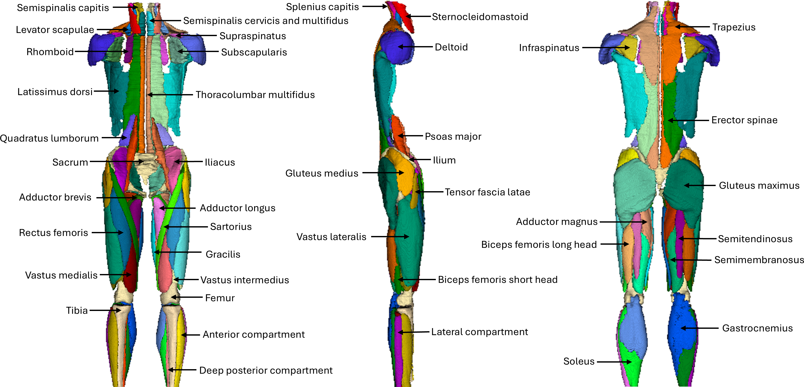

  

  

  
    

    

      
Open-source toolbox

      <h1>MuscleMap</h1>
      

        Whole-body muscle segmentation and quantitative analysis for large-scale imaging studies.
      

      

        <a class="mm-btn mm-btn-primary" href="installation.html">Get started</a>
        <a class="mm-btn mm-btn-ghost" href="usage.html">View examples</a>
      

      

        Built for researchers, clinicians, and data scientists working with whole-body MRI and CT.
      

    

  

  <h2>Features</h2>
  
  
    

      

        <h3>Whole-body muscle segmentation</h3>
        

          Designed for whole-body imaging with consistent labelling across muscles and bones,
          enabling large-scale, multi-region analyses.
        

      

      

        
      

    

    

      

        <h3>Quantitative metrics</h3>
        

          Extract muscle-specific metrics such as volumes and fat-related measures across multiple contrasts. 
        

      

      

        
      

    

    

      <h3>Integrates in pipelines</h3>
      

        Github GUI and Slicer extension so you can easily run MuscleMap and/or inspect
        individual cases for quality control.
      

    

  

  <h2>Quick links</h2>
  

    <a class="mm-link-card" href="installation.html">
      <h3>Installation</h3>
      
Set up the MuscleMap environment with conda and install the toolbox in editable mode.

    </a>
    <a class="mm-link-card" href="usage.html">
      <h3>Usage</h3>
      
Learn how to run <code>mm_segment</code>, <code>mm_extract_metrics</code>, and <code>mm_gui</code>.

    </a>
  

  <h2>Typical workflow</h2>
  <ol class="mm-steps">
    <li><strong>Prepare data</strong> – organise your images and (optionally) metadata.</li>
    <li><strong>Run segmentation</strong> – use <code>mm_segment</code> to generate label maps.</li>
    <li><strong>Extract metrics</strong> – compute quantitative measures with <code>mm_extract_metrics</code>.</li>
    <li><strong>Analyse</strong> – integrate metrics with clinical outcomes or other data sources.</li>
  </ol>

