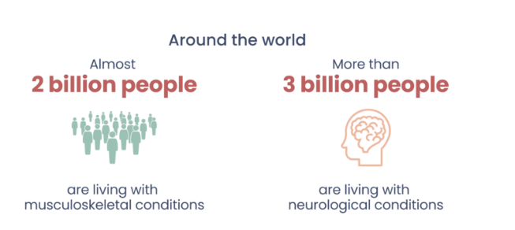

## Navigating to the root of debilitating disease

Musculoskeletal and neurological conditions affect **billions of people worldwide** and consistently rank among the **top 10 contributors to the global burden of disease**. Despite their enormous impact on quality of life, independence, and healthcare systems, these conditions are often detected **late**, when symptoms are already advanced and treatment options are limited.

**MuscleMap** was created to address this gap. It is a transformative, open-source initiative—comparable in ambition to the **Human Genome Project**—focused on systematically mapping skeletal muscle health across the entire human body. By doing so, MuscleMap aims to become a foundational clinical and research resource for the **early detection, monitoring, and treatment of debilitating disease**.

---

### Why muscle matters

Skeletal muscle is far more than a system for movement. Changes in muscle size, shape, and composition often occur **years before** overt clinical symptoms emerge in a wide range of conditions, including:

- musculoskeletal disorders  
- neurological disease  
- metabolic and systemic illness  
- ageing-related functional decline  

As populations grow and age, the prevalence of these conditions will rise sharply. In Australia alone, healthcare costs related to musculoskeletal and neurological conditions are projected to exceed **$21 billion by 2033**, representing an increase of more than **300%**. Similar trends are observed globally. Early, objective, and scalable assessment of muscle health is therefore no longer optional—it is essential.

---

### What is MuscleMap?

MuscleMap is an **AI-driven imaging platform and global dataset** that uses advanced deep learning models to automatically segment skeletal muscle from **MRI and CT scans**, anywhere in the body. From these segmentations, MuscleMap derives **precision biomarkers** that quantify muscle size, shape, and spatial distribution.

Unlike traditional approaches that rely on manual analysis or focus on a single muscle group, MuscleMap is designed to be:

- **Whole-body** – applicable to any anatomical region  
- **Automated** – removing the need for time-consuming manual work  
- **Standardised** – enabling consistent measurements across centres  
- **Scalable** – suitable for both clinical use and large population studies  

The long-term vision is for MuscleMap to operate as a true **“push-button” system**. A clinician uploads a scan, and within moments receives a comprehensive set of muscle health metrics that are directly interpretable in a clinical context.

---

### Precision, context, and normative ranges

Muscle health is not one-size-fits-all. Age, sex, body composition, ancestry, and other demographic factors all strongly influence what constitutes “normal” muscle. MuscleMap explicitly accounts for this variability.

Drawing on data from **over 100,000 scans**, MuscleMap enables muscle biomarkers to be interpreted relative to **population-specific normative ranges**. This allows clinicians and researchers to distinguish between healthy variation and clinically meaningful muscle decline—an essential step toward precision medicine.

---

### A global, open resource

MuscleMap is **open source and freely accessible**. Over the past five years, it has grown into a **global consortium of more than 60 collaborators**, spanning institutions, countries, and imaging platforms. Contributors upload their own datasets, helping to model healthy muscle across diverse populations worldwide.

By combining large-scale imaging data with transparent methods and collaborative governance, MuscleMap aims to accelerate discovery, improve clinical decision-making, and ultimately reduce the burden of debilitating disease.

---

In short, **MuscleMap is about seeing disease earlier—by seeing muscle differently**.
